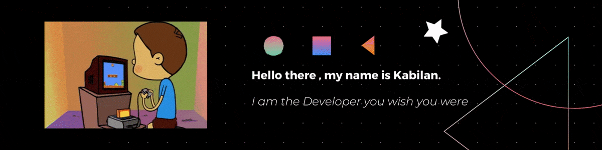

<!-- https://i.imgur.com/TDisMSC.gif -->

<!-- 
 -->
 

### Heyyy SIRI 🔊 Tell them About me 🥺 

<!-- **kabilanvennila/kabilanvennila** is a ✨ _special_ ✨ repository because its `README.md` (this file) appears on your GitHub profile.

Here are some ideas to get you started: -->

- 🌱 I’m currently learning React and Deep learning
- 👯 You can Ping me for Colab
- 😄 Have a Nyshh day :)

<!-- - 🤔 I’m looking for help with ...
- 💬 Ask me about ...
- 📫 How to reach me: ...
- 😄 Pronouns: ...
- ⚡ Fun fact: ... -->

[![alt text][1.1]][1]
[![alt text][2.1]][2]

<!-- icons with padding -->

[1.1]: https://www.pngkit.com/png/detail/14-145502_linkedin-color-icon-linkedin-logo-round-png.png 
[2.1]: http://i.imgur.com/P3YfQoD.png 

<!-- links to your social media accounts -->

[1]: https://www.linkedin.com/in/kabilan-m-90067018b/
[2]: http://www.facebook.com/sednaoui

